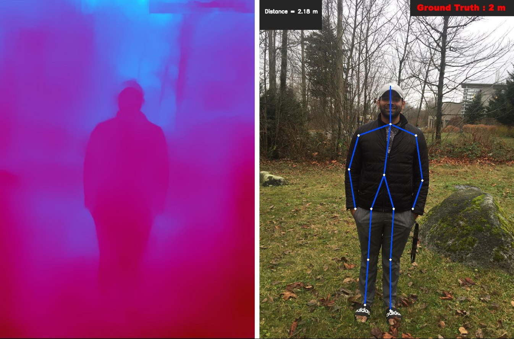

## Robot that Promotes Physical Distancing

Social distancing is the primary strategy used to prevent the spread of the virus that causes COVID-19. As the name suggests, it calls for people to increase the space between one another and to avoid gatherings and crowds. Humanoid robots can come handy in promoting physical distancing, both for the safety of the robot (we don't want the robot to carry the virus) and for giving an alarm to people in special cases eg. a chashier or a bank agent. 

This project aims to address the problem of detecting a human in a single RGB image and 
finding its distance from the camera (robot). 
We employ [OpenPose](https://github.com/CMU-Perceptual-Computing-Lab/openpose) as a human detection algorithm and [DenseDepth](https://github.com/ialhashim/DenseDepth) ([arXiv2018](https://arxiv.org/abs/1812.11941)) as a depth estimation algorithm.
The OpenPose algorithm outputs HeatMaps from body points. (Which are joined later). 

We multiply HeatMaps and DepthMaps to obtain the distance matrix. Then we define a depth_normalizer parameter to convert the
obtained distance matrix to the ground truth data. 

### Quick Demo

Run the provided jupyter notebook (distance_estimation.ipynb)

### Results
<div>
   
   
   
   
   
   
   
</div>


## Reference
Corresponding papers to cite:
```
@article{Alhashim2018,
  author    = {Ibraheem Alhashim and Peter Wonka},
  title     = {High Quality Monocular Depth Estimation via Transfer Learning},
  journal   = {arXiv e-prints},
  volume    = {abs/1812.11941},
  year      = {2018},
  url       = {https://arxiv.org/abs/1812.11941},
  eid       = {arXiv:1812.11941},
  eprint    = {1812.11941}
}

@inproceedings{cao2018openpose,
  author = {Zhe Cao and Gines Hidalgo and Tomas Simon and Shih-En Wei and Yaser Sheikh},
  booktitle = {arXiv preprint arXiv:1812.08008},
  title = {Open{P}ose: realtime multi-person 2{D} pose estimation using {P}art {A}ffinity {F}ields},
  year = {2018}
}

```
